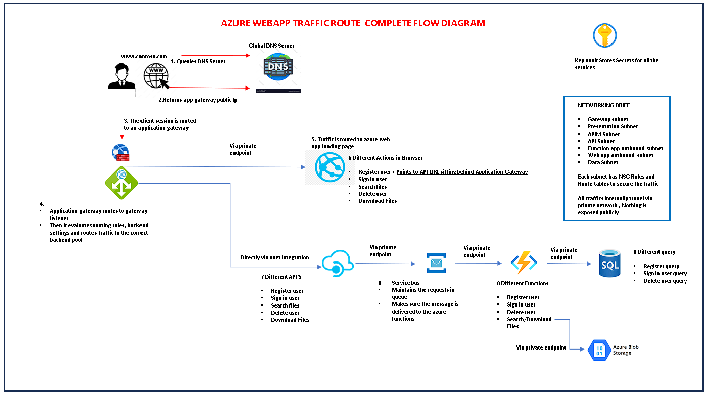
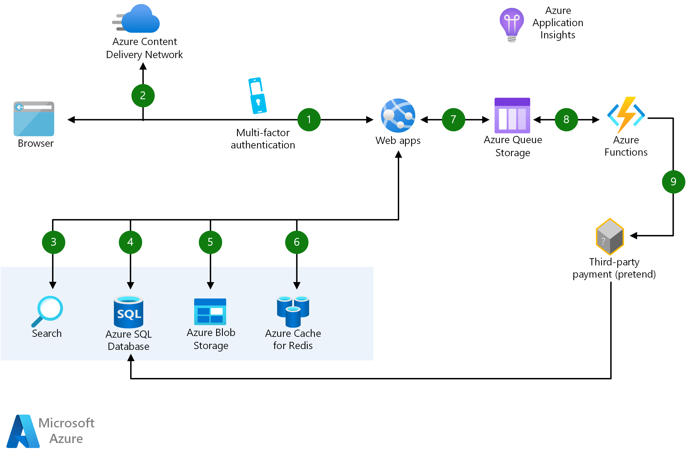
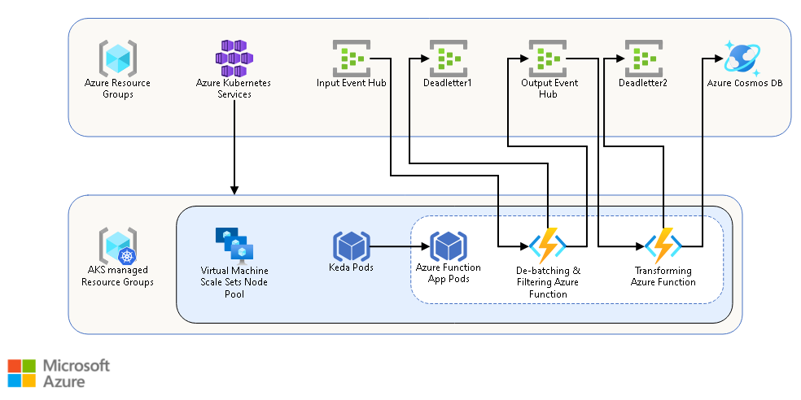
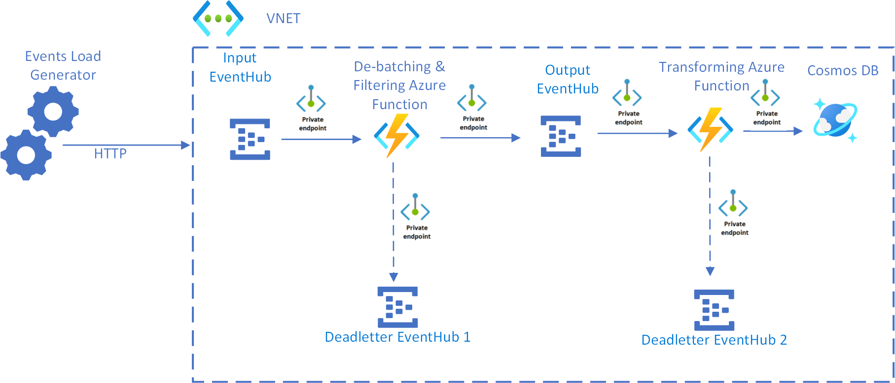
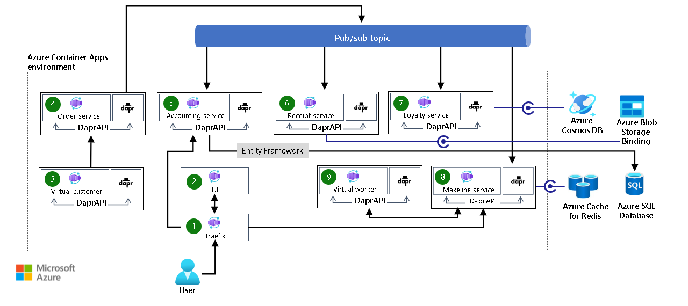
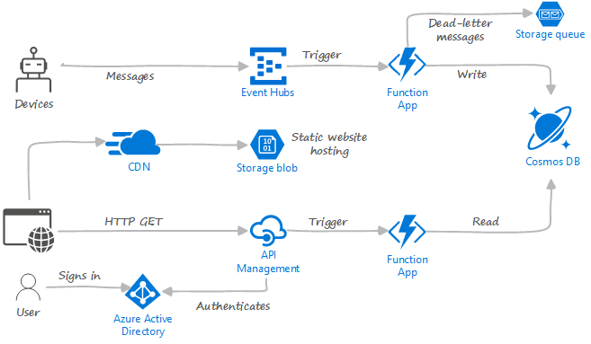

# Azure PAAS Architecture

## PAAS Architecture 1

## PAAS Architecture 2

User accesses the web app in browser and signs in.

Browser pulls static resources such as images from Azure Content Delivery Network.

User searches for products and queries SQL database.

Web site pulls product catalog from database.

Web app pulls product images from Blob Storage.

Page output is cached in Azure Cache for Redis for better performance.

User submits order and order is placed in the queue.

Azure Functions processes order payment.

Azure Functions makes payment to third party and records payment in SQL database.

## PAAS Architecture 3

AKS with the KEDA scaler is used to autoscale Azure Functions containers based on the number of events needing to be processed.

Events arrive at the Input Event Hub.

The De-batching and Filtering Azure Function is triggered to handle the event. This step filters out unwanted events and de-batches the received events before submitting to the Output Event Hub.

If the De-batching and Filtering Azure Function fails to store the event successfully, the event is submitted to the Deadletter Event Hub 1.

Events arriving at the Output Event Hub trigger the Transforming Azure Function. This Azure Function transforms the event into a message for the Azure Cosmos DB instance.

The event is stored in an Azure Cosmos DB database.

### Without Private Endpoint 

### With Private Endpoint

## PAAS Architecture 4

Traefik: The basic proxy for routing user requests from the UI to the accounting and Makeline services for the interactive dashboard.

UI: A dashboard that shows real-time order and aggregated sales data for the Reddog order management system.

Virtual customer: A customer simulation program that simulates customers placing orders via the order service.

Order service: A CRUD API to place and manage orders.

Accounting service: A service that processes, stores, and aggregates order data. It transforms customer orders into meaningful sales metrics that are showcased by the UI.

Receipt service: An archival program that generates and stores order receipts for auditing and historical purposes.

Loyalty service: A service that manages the loyalty program by tracking customer reward points based on order spend.

Makeline service: A service that's responsible for managing a queue of current orders awaiting fulfillment. It tracks the processing and completion of the orders by the virtual worker service.

Virtual worker: A worker simulation program that simulates the completion of customer orders.

Bootstrapper (not shown): A service that uses Entity Framework Core to initialize the tables within Azure SQL Database for use with the accounting service.

## PAAS Architecture 5

### Event Injestion

Drone messages are ingested by Azure Event Hubs.

Event Hubs produces a stream of events that contain the message data.

These events trigger an Azure Functions app to process them.

The results are stored in Azure Cosmos DB.

### Web app:

Static files are served by CDN from Blob storage.
A user signs into the web app using Microsoft Entra ID.
Azure API Management acts as a gateway that exposes a REST API endpoint.
HTTP requests from the client trigger an Azure Functions app that reads from Azure Cosmos DB and returns the result.

